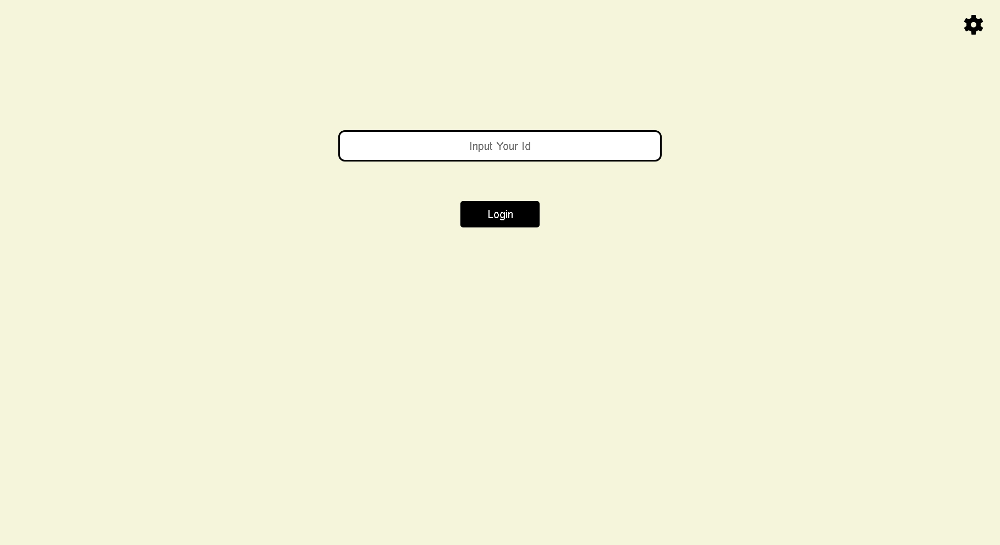
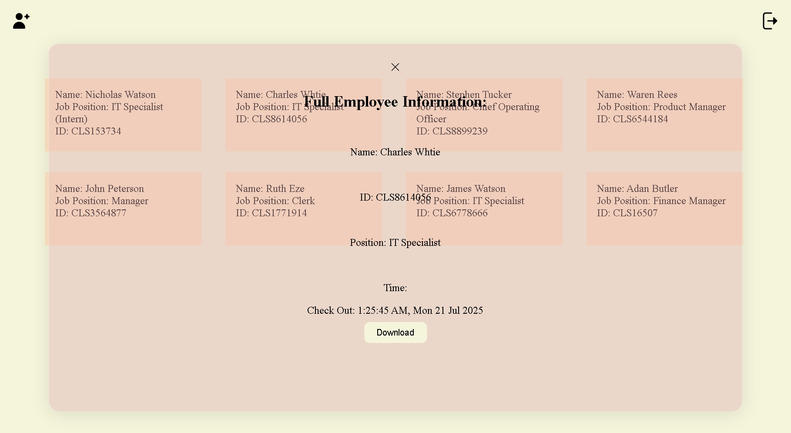
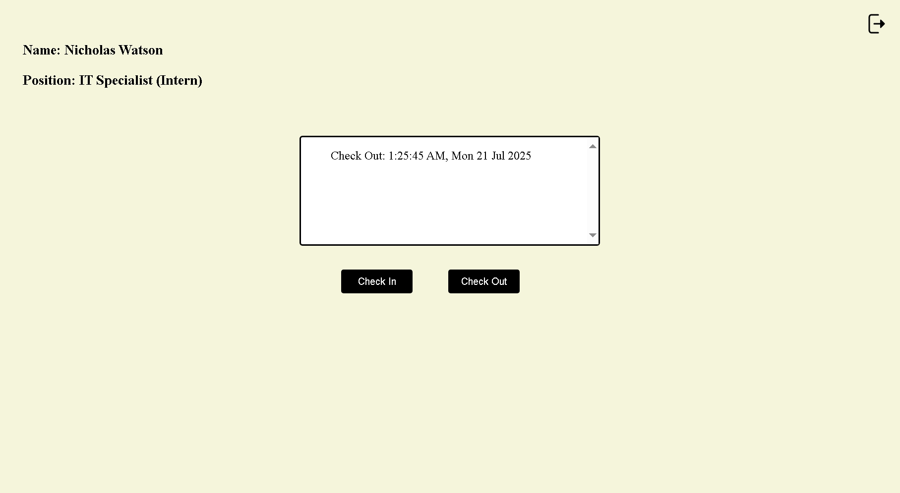
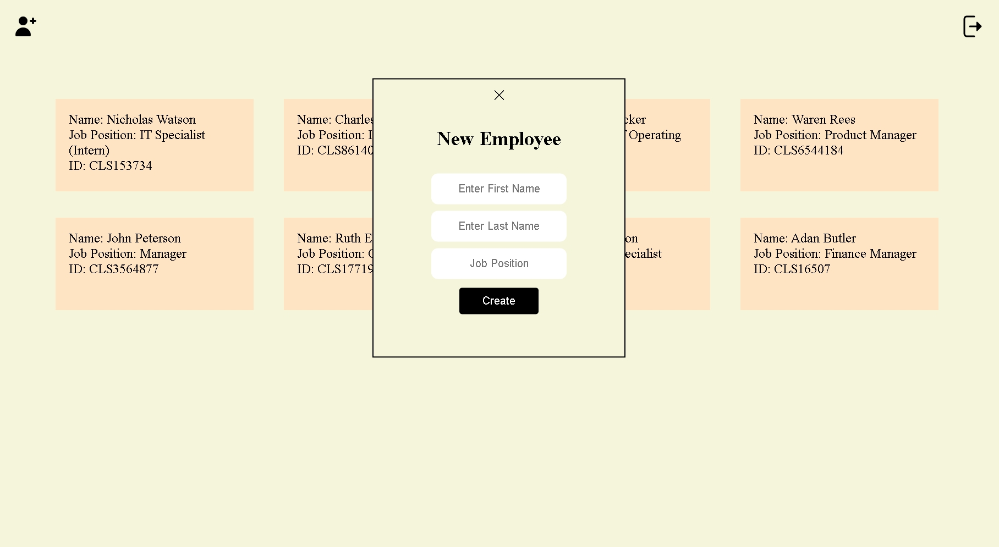
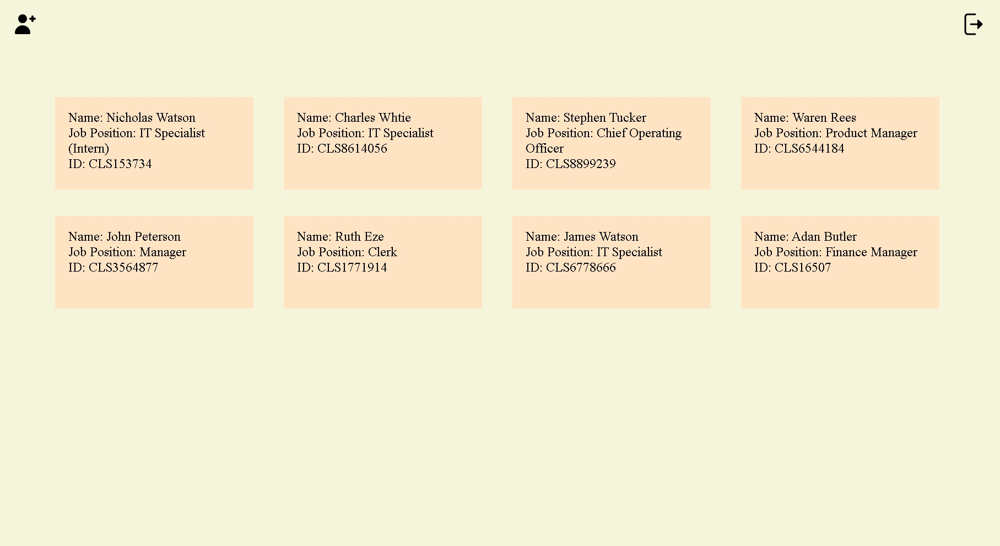

#  Clock-In System

[](LICENSE)
[](https://developer.mozilla.org/en-US/docs/Web/JavaScript)
[](https://firebase.google.com/)
[](https://github.com/parallax/jsPDF)

A **responsive**, Firebase-powered web dashboard for managing employee clock-ins. Features include detailed pop-ups, time logs, and PDF exports.

---

##  Features

-  **Grid view of employees**
-  **Click any employee to view full details**
-  **Display time logs per employee**
-  **Handles employees without time logs**
-  **Download details as PDF using jsPDF**
-  **Connected to Firebase (Firestore or Realtime DB)**

---

##  Built With

- **HTML5**  
- **CSS3**  
- **JavaScript (ES6+)**  
- **Firebase** – for data storage  
- **jsPDF** – for PDF generation  

---

## Project Structure

```plaintext
/Clock-In-System
│
├── index.html  
├── Admin_Login.html  
├── Admin_Dashboard.html  
├── Check_In_Out.html
├── Employee_Info.html       
├── style.css          
├── script.js          
├── firebase.js        
├── /icons
├── /Flow              
└── README.md
```
---

## Getting Started

1. **Clone the repo**:
   ```bash
   git clone https://github.com/your-username/employee-attendance-dashboard.git
   cd employee-attendance-dashboard
   ```

2. **Add Firebase Config**:
Create a firebase.js file and paste your Firebase credentials:
    ```bash
    const firebaseConfig = {
    apiKey: "YOUR_API_KEY",
    authDomain: "YOUR_AUTH_DOMAIN",
    projectId: "YOUR_PROJECT_ID",
    storageBucket: "YOUR_STORAGE_BUCKET",
    messagingSenderId: "YOUR_MESSAGING_ID",
    appId: "YOUR_APP_ID"
    };

    firebase.initializeApp(firebaseConfig);
    const db = firebase.firestore(); // Or use realtime DB
    ```

3. **Open index.html in a browser (double-click or use Live Server).**

**How It Works**
    ### Employee End: 
    - Employee Inputs their ID number on the Employee login page (Default page)
    - If ID number exist access is granted to the check-in/out will be given
    - On that page employee sees their full name, job position and check-in/out history(if any), and check-in/out buttons. 
    - When they are done, they  log out using at the top right conner of the page. 

    *To navigate to the admin login page from employee login*
    > click the `⚙` icon at the top right of the employee login page
    *To navigate to employee login page from admin login page*
    > click on the `👥` icon at the top right of the admin page

        
    ### Admin End:
    - Admin Inputs their ID Number on the Admin Login page
    - If Admin ID number exsit acess is granted to admin dashboard
    - The Dashboard shows eall the employees in the commany at the moment.
    - Clicking on anynof the employees displays their full information,(names, position, and check-in/out history) and a download button that allows you to download the full information of the employee in PDF format
    - New employees can be created by clicking on the `👤<sup>+</sup>` icon and fill in the appropriate detials, then click on create. 
    
##
## Screenshots






## License
    Licensed under the [MIT](LICENSE) License.

## Author
    ###ThankGod Ausaji
    GitHub: @[01TGMA](https://github.com/01TGMA)
    LinkedIn: [ThankGod Ausaji](https://www.linkedin.com/in/thankgod-ausaji/)

## Show Support
If you found this project useful, give it a ⭐ on GitHub and share it with others!
